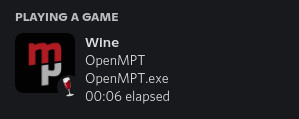
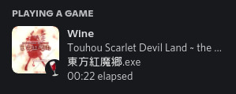

# wine-rpc
wine-rpc provides a Discord Rich Presence for any programs running under Wine.

 
## Why?
Using the Discord app itself, you can already add anything running under Wine as your current activity. However, Discord is not so good at keeping track of Wine programs; after a while, your programs won't get detected anymore and you would have to add them again.

Using a rich presence, we can literally put anything as your activity without relying on Discord to detect it. And as a bonus, supported apps could have their icon displayed on the rich presence, and you could also have multiple presences for multiple apps at the same time.
## Installing
wine-rpc requires no installation. Simply download a prebuilt binary from the [Releases](https://github.com/LeadRDRK/wine-rpc/releases) page and extract it anywhere or build it yourself.

Please put it somewhere with write access; wine-rpc keeps it simple by creating the config file in the same folder.

You must also download the [app list](https://github.com/LeadRDRK/wine-rpc-app-list) yourself! It is not included in the binary packages or the source code.
## Usage
Using wine-rpc is fairly simple, simply open up a terminal and run the program. The program will now scan for any running Wine processes, check if it's in the app list, then show the rich presence. Any apps not in the app list will not be shown, but that behavior can be customized as shown in the Configuration section below.

If you want it to run as a daemon, use `wine-rpc -d` to start it and `wine-rpc -k` to kill all running daemons.

You should run the daemon at startup too. It's pretty lightweight and won't do much until a program of its interest starts, so having it in the background at all times is perfectly fine.
## Configuration
After running wine-rpc for the first time, a file named config.txt will be created. This file can be used to set a few options:
- `show_unrecognized_apps` - By default, only apps that have an entry in the app list will be shown. Setting this option to 1 will show all running processes (including any background processes that you might have, except for Wine services)
- `hide_exec_name` - If this is set to 1, when an app has an entry in the app list, the executable's name will be hidden and only the app's name will be shown.
## App Support
The names and icons of all applications are taken from the app list. If you don't see your favorite application in the app list, please create an issue in https://github.com/LeadRDRK/wine-rpc-app-list so I could add it for you. Every kind of application are supported, so please don't refrain yourself from requesting anything.

You could also add it to the app list yourself, but please prefer the former so everyone could have a rich presence for the same app!
## Compiling
wine-rpc requires the Discord Game SDK which is not included in this repository. Download it from [here](https://discord.com/developers/docs/game-sdk/sdk-starter-guide) and extract it into `discord_game_sdk` in the project's root.

CMake is used for generating the build files. Create a `build` folder in the project's root and run `cmake ..` to generate them, then run the build system.

The full procedure should look something like this:
```bash
cd wine-rpc
mkdir build
cd build
cmake .. -DCMAKE_BUILD_TYPE=Release
make
```
## License
This project is licensed under the [GNU GPLv3](LICENSE) license.
